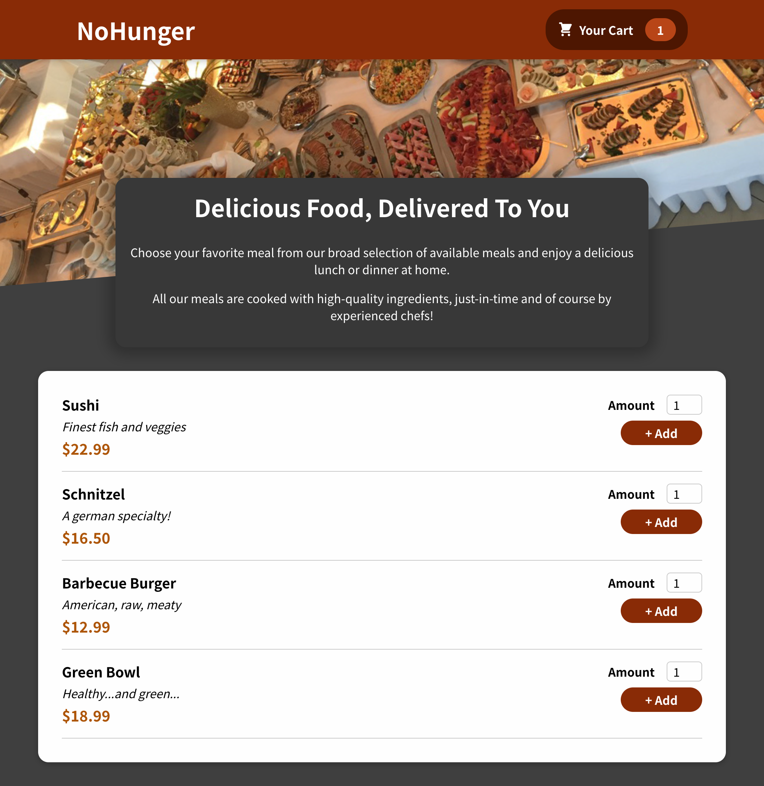
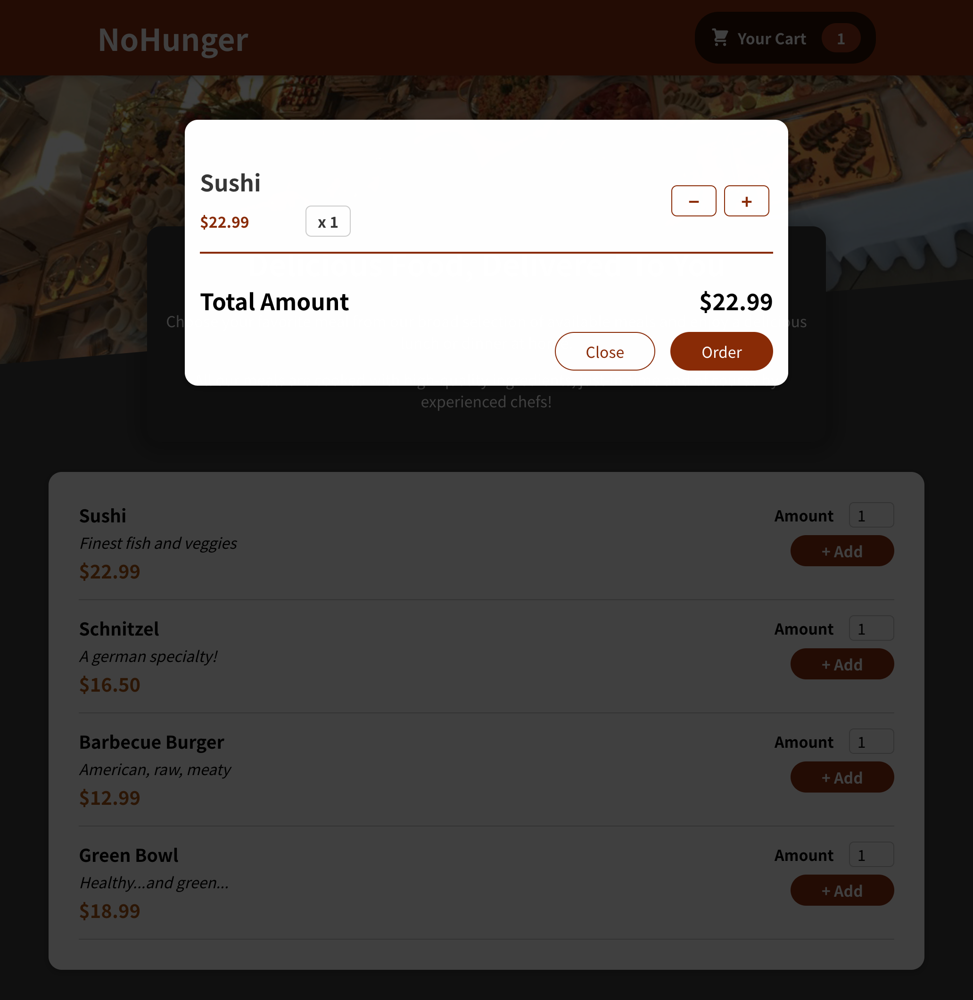
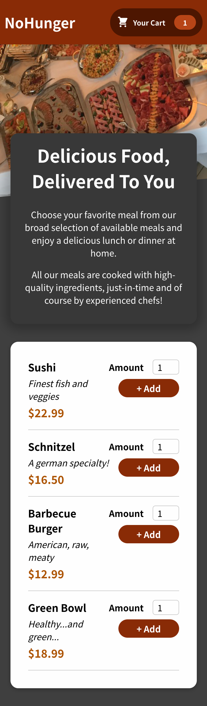

# NoHunger

NoHunger is a website where user can book food from the available meals option. The website is cross platform supported and optimised for all kind of devices.

## Table of contents

- [Overview](#overview)
  - [The challenge](#the-challenge)
  - [Screenshot](#screenshot)
  - [Links](#links)
- [My process](#my-process)
  - [Built with](#built-with)
  - [What I learned](#what-i-learned)
- [Author](#author)
- [Acknowledgments](#acknowledgments)

## Overview

### The challenge

Users should be able to:

- View the optimal layout depending on their device's screen size
- See hover states for interactive elements
- Using Advance React Hooks for solving complex problems encountered in the website

### Screenshot

### Links

- Solution URL: [Solution URL](https://github.com/ivabby/NoHunger)
- Live Site URL: [Live Site URL here](https://nohunger.herokuapp.com/)

## My process

### Built with

- Semantic HTML5 markup
- CSS custom properties
- Flexbox
- CSS Grid
- Mobile-first workflow
- Bootstrap
- [React](https://reactjs.org/) - JS library
- [Next.js](https://nextjs.org/) - React framework
- [Styled Components](https://styled-components.com/) - For styles

### What I learned

In this challange I learned how to use React reusable components. In this website I also learned about how to integrate bootstrap with React to use flexbox.

## Author

- Website - [Vaibhav Singh](https://github.com/ivabby)
- Twitter - [@iamvabby](https://twitter.com/iamvabbyy)

## Acknowledgments

I would like to thank the W3schools, Udemy, Various articles on Medium which helped me gain insights of the concepts of React.
